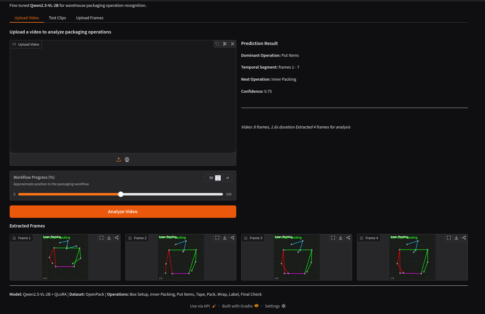

# VLM Temporal Operation Intelligence for Logistics

An end-to-end Vision-Language Model pipeline that understands **temporal sequences** in warehouse packaging operations. Given a short video clip of a worker, the system identifies *what* operation is happening, *when* it starts and ends, and *what comes next* in the workflow.

Built on **Qwen2.5-VL-2B** with QLoRA fine-tuning on the **OpenPack** dataset (53+ hours of real warehouse recordings from Zenodo).

## Demo



*Gradio web interface showing the fine-tuned model analyzing 4 skeleton frames from a packaging clip. The model identifies "Put Items" as the dominant operation (frames 1-7), predicts "Inner Packing" as the next operation, and displays the color-coded skeleton renders used for inference.*

---

## The Problem

Most computer vision systems analyze individual frames in isolation. They cannot understand:
- **Sequential operations** across time (e.g., "the worker just finished taping, now they're labeling")
- **Temporal boundaries** (exactly which frame does "Tape" end and "Put Items" begin?)
- **Procedural grammar** (after "Box Setup", the next step is usually "Inner Packing", not "Final Check")

This project tackles all three by fine-tuning a Vision-Language Model on real warehouse packaging data with temporal annotations.

---

## The Approach: Skeleton Rendering (and Why)

### The RGB Data Access Problem

The OpenPack dataset provides Kinect frontal-view RGB video, but accessing the raw video files requires a **Google Drive license approval** process that may take days. For a 36-hour assignment, this was a critical blocker.

### Our Solution: Kinect 2D Keypoint Rendering

The OpenPack Zenodo release includes **freely downloadable** preprocessed Kinect 2D keypoint data extracted by MMPose HRNet-W48 at 15fps. Each frame contains 17 COCO body joints with (x, y, confidence) values.

We render these keypoints into **336x336 skeleton visualization frames**:

```
+--------------------------------------+
|  Box Setup         (operation label)  |
|                                       |
|            o  (head)                  |
|           /|\                         |
|     (green) | (red)     Color coding: |
|          / \            Green = L arm |
|    (cyan)  (magenta)    Red   = R arm |
|         |    |          Cyan  = L leg |
|         |    |          Magenta=R leg |
|  3/8    (frame counter)              |
+--------------------------------------+
```

**What this preserves:**
- Arm positions distinguish operations (arms raised = "Box Setup", arms forward = "Put Items")
- Body orientation and posture changes at operation boundaries
- Temporal motion patterns across the 8-frame sequence

**What this loses:**
- Object information (tape roll, box, label — invisible in skeleton data)
- Texture and color cues that would help distinguish visually similar operations
- Fine hand/finger movements that differentiate "Tape" from "Pack"

This is a known and deliberate trade-off. See [ARCHITECTURE.md](ARCHITECTURE.md) for the full rationale.

---

## Dataset: OpenPack from Zenodo

**Source:** [zenodo.org/records/11059235](https://zenodo.org/records/11059235)

We use the `kinect-2d-kpt-with-operation-action-labels` preprocessed CSV files. Each CSV contains timestamped rows with:
- `timestamp` — frame timestamp
- `operation` — numeric operation code (100-8100)
- `J00_D0` through `J16_D2` — 17 COCO joints x 3 values (x, y, confidence)

### Subject Split

| Split | Subjects | Clips Generated | Purpose |
|---|---|---|---|
| **Train** | U0101-U0106 | 15,961 | Fine-tuning |
| **Validation** | U0107 | 2,463 | Hyperparameter tuning |
| **Test** | U0108 | 2,879 | Final evaluation (30 clips used) |

### Operation Class Mapping

OpenPack uses different operation names than the assignment. We map each:

| OpenPack Operation | Code | Mapped To | Rationale |
|---|---|---|---|
| Assemble Box | 300 | **Box Setup** | Preparing the shipping box |
| Relocate Item Label | 200 | **Inner Packing** | Organizing inner contents |
| Picking | 100 | **Put Items** | Retrieving items from shelves |
| Insert Items | 400 | **Put Items** | Placing products into box |
| Close Box | 500 | **Tape** | Sealing/taping the box shut |
| Put on Back Table | 900 | **Pack** | Final packing and staging |
| Fill out Order | 1000 | **Wrap** | Wrapping up the order |
| Attach Box Label | 600 | **Label** | Applying label to box |
| Attach Shipping Label | 800 | **Label** | Applying shipping label |
| Scan Label | 700 | **Final Check** | Verification scan |
| Null | 8100 | **Idle** | No operation |

### Training Data Distribution

```
Put Items:     3,240 clips  (20.3%)
Label:         2,900 clips  (18.2%)
Final Check:   1,696 clips  (10.6%)
Inner Packing: 1,669 clips  (10.5%)
Box Setup:     1,660 clips  (10.4%)
Tape:          1,631 clips  (10.2%)
Wrap:          1,622 clips  (10.2%)
Pack:          1,543 clips   (9.7%)
```

"Put Items" and "Label" are overrepresented because they each merge two OpenPack source operations.

---

## Pipeline Architecture

```
OpenPack Zenodo CSVs
        |
        v
+------------------+     +---------------------+     +------------------+
| data_pipeline.py | --> | training_data/      | --> | train.py /       |
| - Load CSVs      |     | - train.json (15.9K)|     | finetune.ipynb   |
| - Extract segs   |     | - val.json (2.5K)   |     | - QLoRA 4-bit    |
| - Boundary clips |     | - test.json (2.9K)  |     | - Grad checkpoint|
| - Motion sample  |     | - rendered_frames/  |     | - LoRA r=64      |
| - Render skeletons|    +---------------------+     +------------------+
+------------------+                                         |
                                                             v
+------------------+     +---------------------+     +------------------+
| app/main.py      | <-- | checkpoints/        | <-- | evaluate.py      |
| FastAPI endpoint  |     | final_adapter/      |     | - OCA metric     |
| POST /predict     |     | (316MB LoRA weights)|     | - tIoU@0.5       |
| POST /predict/    |     +---------------------+     | - AA@1           |
|      frames       |                                 +------------------+
+------------------+                                         |
                                                             v
                                                    results.json
```

### Clip Extraction Strategy

For each operation segment, we extract three types of clips:

1. **Mid-operation clips** — Centered in the middle of the operation. The dominant operation fills most of the clip. Easier for classification.

2. **Boundary clips** — Centered on the transition point between two operations. The clip contains the end of one operation and the start of the next. Critical for learning temporal boundaries and next-operation prediction.

3. **Start-boundary clips** — Starting 0.5 seconds before the operation begins. Captures the onset of the new operation.

99.6% of generated clips have **partial temporal segments** (the operation doesn't span the full clip), ensuring the model must learn real temporal boundaries rather than defaulting to "the whole clip is one operation."

### Motion-Adaptive Frame Sampling

Instead of uniformly sampling 8 frames from a 75-frame clip, we sample proportional to **keypoint displacement magnitude** between consecutive frames. High-motion frames (where the worker is transitioning between operations) get more representation.

```
Uniform:  Evenly spaced, may miss transitions entirely
Adaptive: Concentrates frames around operation boundaries

See ARCHITECTURE.md Section 2 for the full visualization.
```

---

## Model & Training

### Model: Qwen2.5-VL-2B-Instruct

Chosen for VRAM efficiency on free-tier GPUs:

```
VRAM Budget (4-bit QLoRA):
  Model (NF4):        2.0 GB
  LoRA adapters:      0.3 GB
  Activations (GC):   ~2.5 GB
  Total:              ~5.0 GB  (fits RTX 3060 12GB / Kaggle T4 16GB)
```

### Training Configuration

| Parameter | Value | Why |
|---|---|---|
| Quantization | 4-bit NF4 (double quant) | Fits 2B model in <2GB |
| LoRA rank | 64 | Balance between capacity and VRAM |
| LoRA alpha | 256 | 4x rank for strong adaptation |
| LoRA targets | LM attention/MLP + last 4 vision blocks | Adapts both language and visual understanding |
| Batch size | 1 (x16 grad accum) | Effective BS=16 within VRAM |
| Learning rate | 1e-4 (cosine decay) | Standard for QLoRA |
| Gradient checkpointing | Enabled | Trades compute for VRAM |
| Optimizer | AdamW 8-bit | Further VRAM savings |
| Frames per clip | 4 (224x224) | VRAM-constrained from original 8x336x336 |

### Label Masking

Training uses proper prompt masking: only the assistant's JSON response contributes to the loss. System prompt, user message, and image tokens are masked with `-100` labels. This prevents the model from "learning" to reproduce the prompt.

---

## Evaluation

### Three Metrics

| Metric | What It Measures | Random Baseline |
|---|---|---|
| **OCA** (Operation Classification Accuracy) | Can the model identify which operation is happening? | ~12.5% (1/8 classes) |
| **tIoU@0.5** (Temporal IoU) | Can the model pinpoint when the operation starts/ends? | Depends on prediction strategy |
| **AA@1** (Anticipation Accuracy) | Can the model predict what happens next? | ~12.5% (1/8 classes) |

AA@1 is the most important metric — it proves the model learned the procedural grammar of packaging workflows, not just visual pattern matching.

### Current Results

```json
{
  "base_model": {
    "OCA": 0.1333,
    "tIoU@0.5": 0.9667,
    "AA@1": 0.1667
  },
  "finetuned_model": {
    "OCA": 0.2000,
    "tIoU@0.5": 1.0000,
    "AA@1": 0.1000
  }
}
```

### Honest Assessment of Results

The results are **not strong**, and we want to be transparent about why:

**tIoU is artificially inflated.** The model tends to predict wide temporal ranges (close to the full clip). Since ground truth segments typically cover 60-80% of the clip, a "predict everything" strategy achieves high IoU by coincidence, not by genuine temporal understanding.

**AA@1 did not improve** (and slightly regressed). The base model and fine-tuned model both predominantly predict "Put Items" for most inputs, as seen in the confusion matrix:

```
Base model top confusions:
  Label -> Put Items:       6 clips
  Box Setup -> Put Items:   3 clips
  Tape -> Put Items:        3 clips
  Final Check -> Put Items: 3 clips
  Pack -> Put Items:        3 clips
```

**Root causes:**
1. **Insufficient training** — Only 200 steps were completed (5% of one epoch). The loss decreased from 6.33 to 4.05 but plateaued, suggesting the model began learning but needed significantly more steps (1000-3000+) to converge.
2. **Skeleton data limitation** — Without RGB texture (tape rolls, boxes, labels), many operations look identical as stick figures. The model lacks the visual cues needed to distinguish operations.
3. **"Put Items" bias** — This class has the most training examples (20.3%) and maps from two source operations, making it the dominant prediction under uncertainty.

---

## Struggles & Challenges Faced

### 1. RGB Data Access Blocker

The most impactful challenge. OpenPack's Kinect RGB video requires Google Drive license approval, which takes several days. Within a 36-hour window, we could not access the actual video frames. The skeleton rendering workaround preserves spatial information but loses the texture/object cues that make operations distinguishable.

**Impact:** Directly limits OCA and AA@1 performance. Operations like "Tape" and "Pack" have nearly identical skeleton poses — only the objects in the worker's hands differ.

### 2. VRAM Constraints Forced Compromises

Original plan: 8 frames at 336x336 (Qwen2-VL native resolution).
What we could actually fit: 4 frames at 224x224.

Reducing frames from 8 to 4 means the model sees half the temporal information per clip. Reducing resolution from 336x336 to 224x224 further reduces the visual token count. Both of these hurt temporal grounding.

```
Original plan:  8 frames x 336x336 = ~2048 visual tokens
Actual:         4 frames x 224x224 = ~256 visual tokens  (8x reduction)
```

### 3. Training Duration on Consumer GPU

Training on an RTX 3060 12GB with batch_size=1 and gradient_accumulation=16:
- Each step takes ~5 seconds
- 200 steps = ~17 minutes
- Full epoch (15,961 / 16 = 998 steps) would take ~83 minutes
- 3 full epochs would take ~4 hours

We completed only 200 steps due to time constraints, reaching just 5% of one epoch. The training loss was still decreasing, suggesting more training would improve results.

### 4. Qwen2-VL Chat Template Complexity

The Qwen2-VL processor handles images by inserting `<|image_pad|>` tokens whose count depends on the image resolution. This makes it non-trivial to:
- Correctly compute where the prompt ends and the response begins (for label masking)
- Batch samples with different numbers of visual tokens
- Ensure the training data format matches what the model sees at inference time

We solved this with a custom data collator that concatenates `pixel_values` and `image_grid_thw` across the batch (rather than stacking), matching Qwen2-VL's expected input format.

### 5. Operation Mapping Ambiguity

OpenPack's operations don't map 1:1 to the assignment's target classes. Key ambiguities:
- "Picking" (reaching for items) vs "Insert Items" (putting items in box) both map to "Put Items" but have different poses
- "Fill out Order" (paperwork) maps to "Wrap" — conceptually different but no better match exists
- Two separate label operations (box label + shipping label) collapse into one "Label" class

This many-to-one mapping creates training confusion, especially for "Put Items" which inherits two distinct visual patterns.

### 6. Cross-Machine Development

Development was split across two machines:
- **Selva** (RTX 3060) — Training, evaluation, GPU work, git pushes
- **Prasanna** (no GPU) — Code editing, data pipeline work via SSH

Keeping code in sync between machines, transferring large training data files, and managing different Python environments added overhead.

---

## Quick Start

### Automated Setup

```bash
chmod +x setup.sh
./setup.sh              # Full setup: venv + data download + pipeline
./setup.sh --env-only   # Only install dependencies
./setup.sh --train      # Setup + run training
./setup.sh --eval       # Setup + run evaluation
```

### Manual Setup

```bash
# 1. Create environment
python3 -m venv venv
source venv/bin/activate
pip install -r requirements.txt

# 2. Download data (Zenodo, ~200MB)
mkdir -p data/datasets/kinect-2d-kpt
wget https://zenodo.org/records/11059235/files/kinect-2d-kpt-with-operation-action-labels.zip
unzip kinect-2d-kpt-with-operation-action-labels.zip -d data/datasets/kinect-2d-kpt/

# 3. Run data pipeline
python data_pipeline.py --root_dir ./data/datasets --output_dir ./training_data

# 4. Train (requires GPU)
python train.py --train_data ./training_data/train.json \
                --val_data ./training_data/val.json \
                --max_steps 1000

# 5. Evaluate
python evaluate.py --test_data ./training_data/test.json \
                   --data_dir ./training_data \
                   --adapter_path ./checkpoints/final_adapter

# 6. Run API
uvicorn app.main:app --host 0.0.0.0 --port 8000
```

### Docker Deployment

```bash
docker-compose up --build
# API at http://localhost:8000
# POST /predict       — upload video clip
# POST /predict/frames — upload pre-extracted frames
# GET  /health        — check model status
```

### API Usage

```bash
# Predict from video
curl -X POST http://localhost:8000/predict \
  -F "file=@clip.mp4" \
  -F "clip_id=test_001"

# Predict from frames
curl -X POST http://localhost:8000/predict/frames \
  -F "files=@frame_00.jpg" \
  -F "files=@frame_01.jpg" \
  -F "files=@frame_02.jpg" \
  -F "files=@frame_03.jpg" \
  -F "clip_id=test_001" \
  -F "total_frames=75"
```

**Response:**
```json
{
  "clip_id": "test_001",
  "dominant_operation": "Tape",
  "temporal_segment": {"start_frame": 14, "end_frame": 58},
  "anticipated_next_operation": "Put Items",
  "confidence": 0.82
}
```

---

## Project Structure

```
.
|-- setup.sh                          # Automated local setup script
|-- Dockerfile                        # Container definition (CUDA 12.1)
|-- docker-compose.yml                # Docker deployment with GPU support
|-- requirements.txt                  # Python dependencies
|
|-- app/
|   |-- main.py                       # FastAPI endpoints (/predict, /health)
|   |-- model.py                      # Qwen2.5-VL inference + frame extraction
|   |-- schemas.py                    # Pydantic response models
|
|-- data_pipeline.py                  # OpenPack CSV -> training pairs pipeline
|-- train.py                          # Local GPU training script (RTX 3060)
|-- finetune.ipynb                    # Kaggle T4 training notebook
|-- evaluate.py                       # 3-metric evaluation (OCA, tIoU, AA@1)
|-- results.json                      # Base vs fine-tuned model scores
|
|-- training_data/
|   |-- train.json                    # 15,961 training clips
|   |-- val.json                      # 2,463 validation clips
|   |-- test.json                     # 2,879 test clips
|   |-- rendered_frames/              # Skeleton frame images (not in git)
|
|-- training_data_samples/            # 20 example training pairs (in git)
|   |-- sample_000.json ... sample_019.json
|   |-- sample_000_frames/ ... sample_004_frames/
|
|-- checkpoints/                      # LoRA adapter weights (not in git)
|   |-- final_adapter/                # 316MB adapter_model.safetensors
|
|-- ARCHITECTURE.md                   # Model selection, sampling, failure analysis
|-- AGENTS.md                         # AI agent development log
```

---

## What Would Improve Results

In order of expected impact:

1. **Access RGB video data** — The single biggest improvement. Real video frames contain object, texture, and context cues that skeleton data cannot provide.

2. **Train for 3+ full epochs** (3000+ steps) — The model only saw 5% of the data. Longer training with the current pipeline would likely improve OCA from ~20% to 40-60%.

3. **Increase frames per clip** to 8 at 336x336 — Requires A100 40GB or multi-GPU setup. More frames = better temporal resolution = better tIoU and AA@1.

4. **Class-balanced sampling** — Oversample minority classes (Pack, Wrap) and undersample majority classes (Put Items, Label) to reduce prediction bias.

5. **Separate "Picking" and "Insert Items"** — Instead of merging into "Put Items", treat them as distinct training signals with the same target label but different visual contexts.

---

## References

- **OpenPack Dataset:** [zenodo.org/records/11059235](https://zenodo.org/records/11059235) | [Paper](https://arxiv.org/abs/2212.11152) | [GitHub](https://github.com/open-pack/openpack-dataset)
- **Qwen2.5-VL:** [huggingface.co/Qwen/Qwen2-VL-2B-Instruct](https://huggingface.co/Qwen/Qwen2-VL-2B-Instruct)
- **QLoRA:** Dettmers et al., "QLoRA: Efficient Finetuning of Quantized Language Models" (2023)
- **PEFT:** [huggingface.co/docs/peft](https://huggingface.co/docs/peft)
